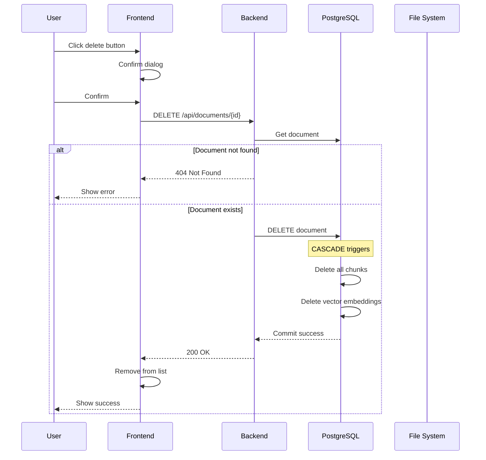
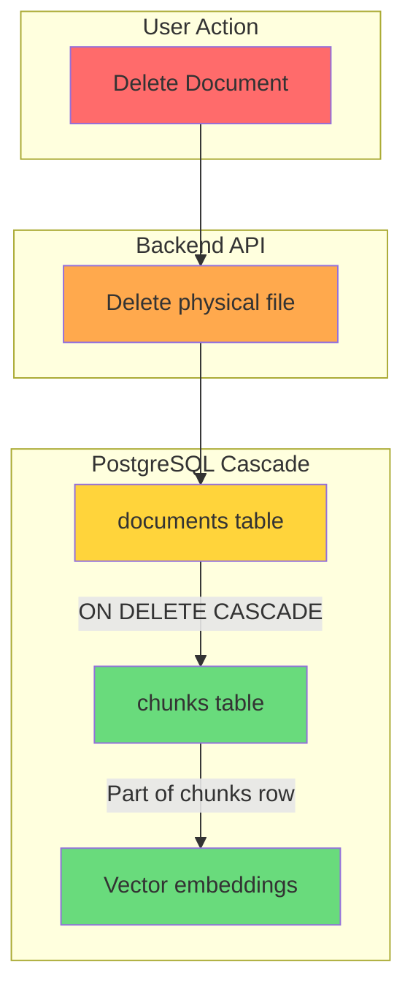

# Document Delete Flow

This document details what happens when a document is deleted in DocuTok.

## Delete Sequence



## Cascade Delete Chain



## What Gets Deleted

| Resource | Deleted? | Method |
|----------|----------|--------|
| Physical file | ✅ Yes | `file_path.unlink()` |
| Document record | ✅ Yes | Direct delete |
| All chunks | ✅ Yes | Foreign key cascade |
| Vector embeddings | ✅ Yes | Part of chunk rows |

## Code Reference

```python
# backend/app/api/routes/documents.py

@router.delete("/{document_id}")
async def delete_document(document_id: int, db: AsyncSession = Depends(get_db)):
    """Delete a document, its chunks, and the physical file."""
    document = await db.get(Document, document_id)
    if not document:
        raise HTTPException(status_code=404, detail="Document not found")
    
    # Delete physical file
    file_path = get_file_path(document.filename)
    if file_path.exists():
        file_path.unlink()
    
    # Delete from database (cascades to chunks)
    await db.delete(document)
    await db.commit()
    
    return {"message": "Document deleted", "id": document_id}
```

## Chunk Cascade Configuration

```python
# backend/app/models/document.py

chunks: Mapped[list["Chunk"]] = relationship(
    back_populates="document", 
    cascade="all, delete-orphan"  # ← Deletes chunks when document is deleted
)
```
