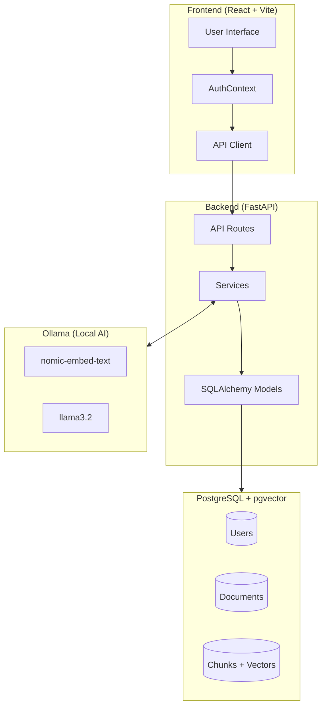
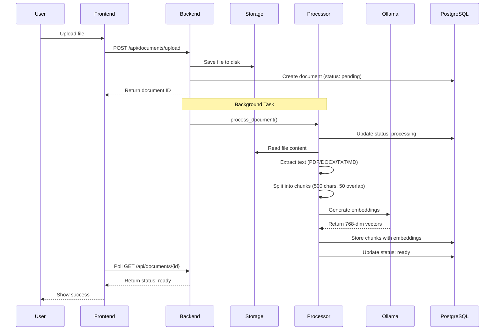
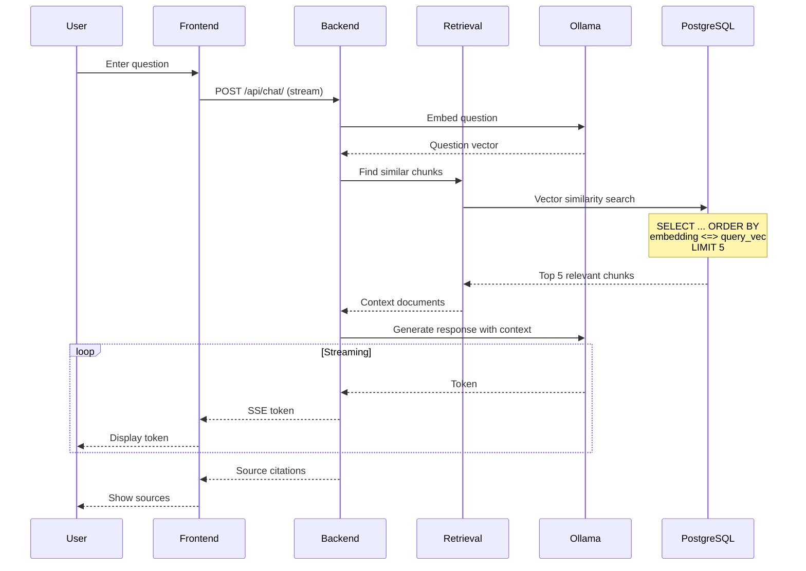
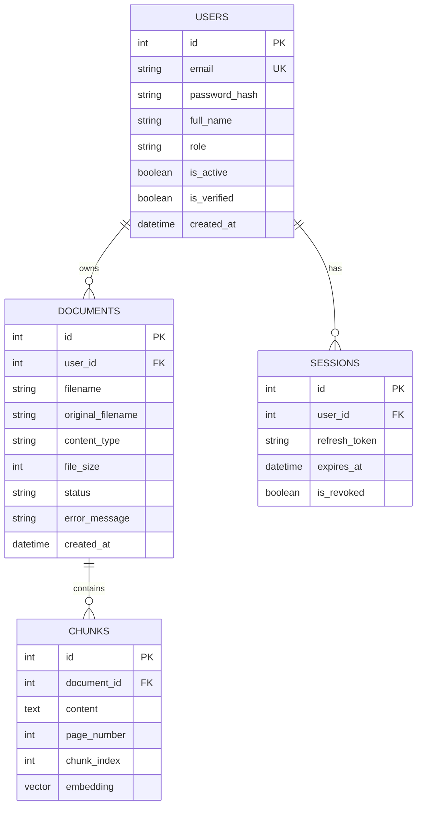
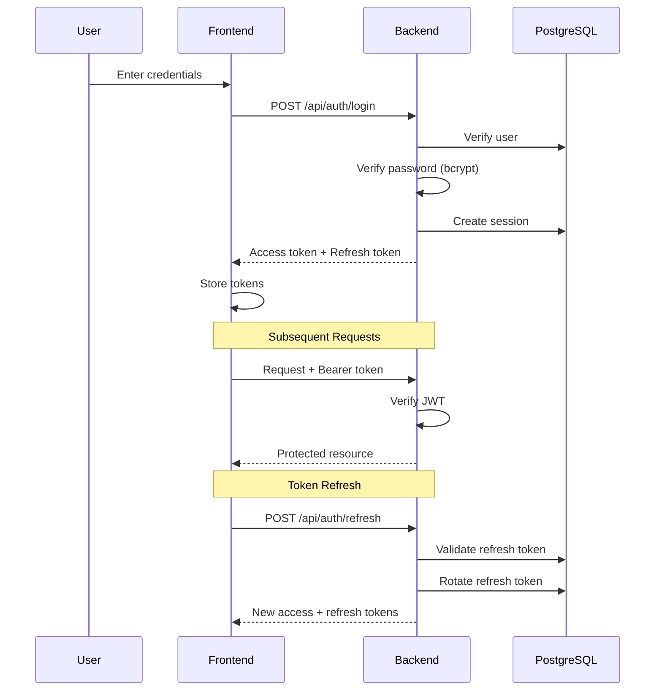
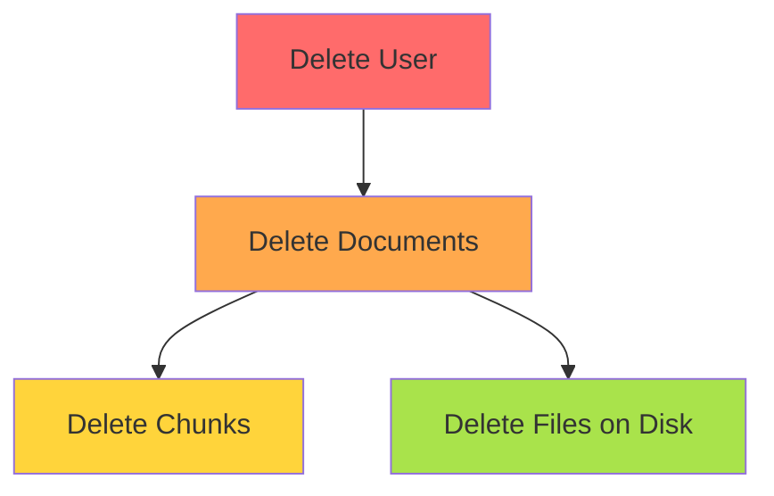

# How DocuTok Works

This document explains the core architecture and data flows in DocuTok.

## System Architecture

## Document Upload Flow

## RAG Chat Flow

## Data Model

## Authentication Flow

## Cascade Delete Behavior

| Action | Cascade Effect |
|--------|---------------|
| Delete User | All user's documents, chunks, and sessions are deleted |
| Delete Document | All chunks (with embeddings) are deleted |
| Delete Session | Only the session is deleted |
