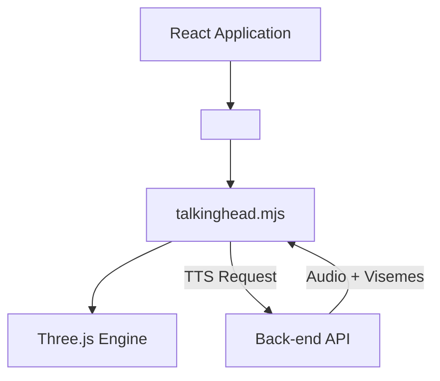
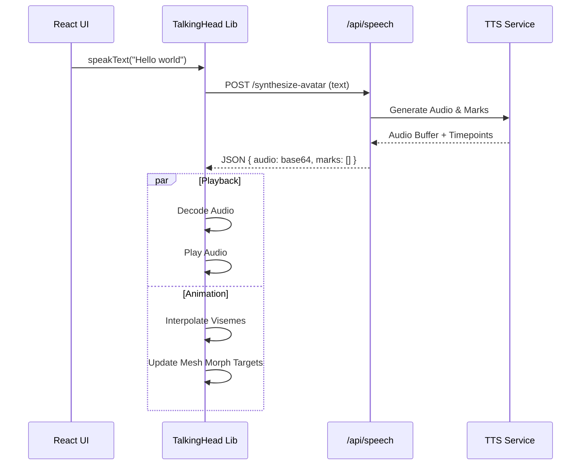

# 3D Avatar Animation Guide

## Overview

DocuGab includes a **3D Talking Head** feature that animates an avatar to lip-sync with the assistant's responses. This provides a more interactive and engaging user experience.

## Architecture

The animation system is built using a custom **TalkingHead** library (based on Three.js) and integrates with the backend's Text-to-Speech (TTS) service.

### Components

1.  **`TalkingHeadAvatar.tsx`**: The React wrapper component that manages the lifecycle of the 3D scene.
2.  **`libs/talkinghead.mjs`**: The core animation engine (Copyright 2024 Mika Suominen). It handles:
    - Loading GLTF/GLB models.
    - Three.js scene management (lights, camera, orbit controls).
    - Lip-sync processing (viseme generation).
    - Skeletal animation (gestures, moods, breathing).
3.  **Backend TTS**: The `POST /api/speech/synthesize-avatar` endpoint generates the audio and timing data required for perfect lip synchronization.



## Implementation Details

### Model Loading
The system supports **Ready Player Me** avatars (.glb format).
- **Default Avatar**: Located at `/assets/avatar.glb`.
- **Custom Avatars**: Users can paste a URL to their own Ready Player Me model in the UI.

### Lip-Syncing
Lip-syncing is data-driven, not merely amplitude-based.
1.  Frontend sends text to Backend.
2.  Backend generates audio and **Viseme Timing** data (phoneme shapes).
3.  Frontend receives the audio + metadata.
4.  The `TalkingHead` library morphs the avatar's mouth mesh (`viseme_aa`, `viseme_E`, etc.) in real-time matching the audio playback.



## Configuration

The `TalkingHead` instance is initialized with specific lighting and camera settings to match the application's aesthetic.

```javascript
const head = new TalkingHead(container, {
    ttsEndpoint: `/api/speech/synthesize-avatar`,
    cameraView: 'upper',      // Focus on head and shoulders
    cameraDistance: 0.5,
    lightAmbientColor: 0xffffff,
    lightAmbientIntensity: 1,
    avatarMood: 'neutral'     // Initial mood
});
```

### Supported Moods
The library supports various emotional states which affect facial expressions and idle animations:
- `neutral` (default)
- `happy`
- `angry`
- `sad`
- `fear`
- `disgust`
- `love`
- `sleep`

### Supported Gestures
Animations can be triggered programmatically (e.g., via specific emoji in text):
- `handup` ✋
- `thumbup` 👍
- `thumbdown` 👎
- `ok` 👌
- `shrug` 🤷‍♂️
- `namaste` 🙏
- `yes` / `no` (Head nods/shakes)

## Troubleshooting

### Avatar Not Loading
- Ensure the GLB file is accessible (CORS headers if external).
- Verify the model is a valid VRM or Ready Player Me GLB with standard bone names (`Head`, `Neck`, `Hips`).

### No Audio/Lip-Sync
- Check that the `ttsEndpoint` is reachable.
- Ensure the selected **Voice** is valid in the backend provider (Google Cloud TTS or local fallback).
- Browser Autoplay Policy: Audio context may need a user gesture (click/interaction) to start.
