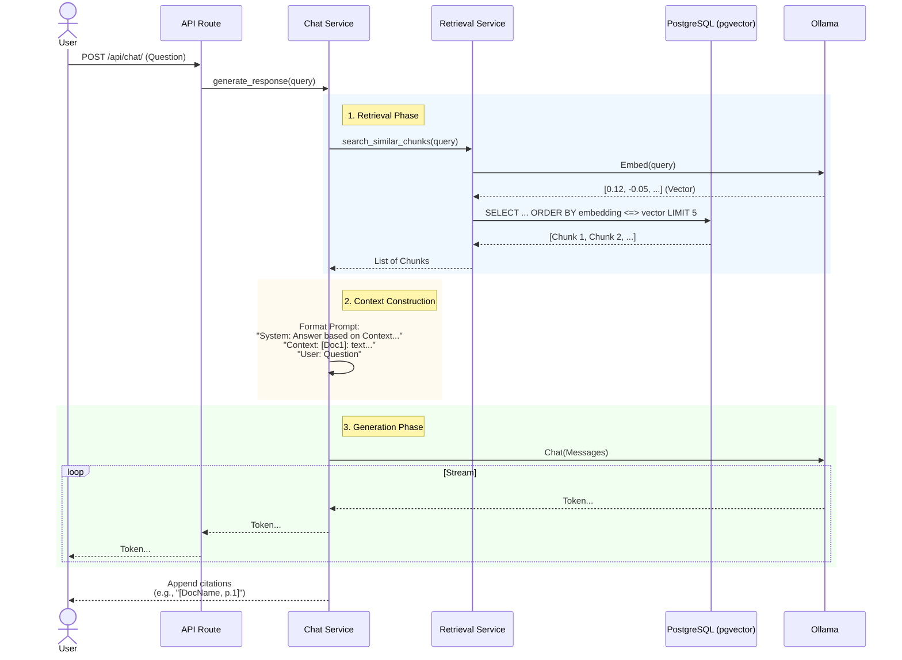

# Ollama and RAG Implementation Guide

This guide details how **DocuGab** implements Retrieval-Augmented Generation (RAG) using **Ollama** for local LLM inference and **PostgreSQL (pgvector)** for vector storage.

## Architecture Overview

The system runs entirely locally, ensuring data privacy and offline capability. It consists of three main components:

1.  **FastAPI Backend**: Orchestrates the application logic and API endpoints.
2.  **Ollama**: Provides the inference engine for both Embeddings and Chat Generation.
3.  **PostgreSQL + pgvector**: Stores document metadata, text chunks, and their vector embeddings.

```mermaid
graph TD
    User[User / Frontend]
    
    subgraph "DocuGab Backend (FastAPI)"
        API[API Endpoints]
        ChatService[Chat Service]
        RetrievalService[Retrieval Service]
        EmbService[Embedding Service]
    end
    
    subgraph "Database Layer"
        PG[(PostgreSQL)]
        Vector[pgvector Extension]
        PG --- Vector
    end
    
    subgraph "AI Inference (Ollama)"
        LLM[LLM Model<br/>(llama3.2)]
        EmbedModel[Embedding Model<br/>(nomic-embed-text)]
    end

    User <--> API
    API --> ChatService
    ChatService --> RetrievalService
    RetrievalService --> EmbService
    EmbService --> EmbedModel
    RetrievalService <--> PG
    ChatService --> LLM
```

## Configuration

The RAG pipeline is configured via environment variables (loaded in `app/core/config.py`).

| Setting | Default Value | Description |
| :--- | :--- | :--- |
| `OLLAMA_BASE_URL` | `http://localhost:11434` | URL where the Ollama service is running. |
| `EMBEDDING_MODEL` | `nomic-embed-text` | Model used to generate vectors for document chunks and queries. |
| `LLM_MODEL` | `llama3.2` | Model used for chat generation. |
| `CHUNK_SIZE` | `500` | Target character count for splitting documents. |
| `CHUNK_OVERLAP` | `50` | Overlap between chunks to maintain context. |

## Implementation Details

### 1. Embeddings Service
**File:** `backend/app/services/embedding.py`

DocuGab uses `langchain_ollama.OllamaEmbeddings` to interface with Ollama.
- **Lazy Loading**: The model instance is created only when first needed via `get_embeddings_model()`.
- **Async Wrapper**: Ollama operations are CPU/IO bound, so we run them in a thread pool using `asyncio.to_thread` to avoid blocking the main event loop.

### 2. Retrieval (The "R" in RAG)
**File:** `backend/app/services/retrieval.py`

We use **Semantic Search** using Cosine Similarity.

1.  **Query Embedding**: The user's question is converted into a vector using the `embedding_model`.
2.  **Vector Search**: We execute a raw SQL query against the `chunks` table.
    - We calculates the **Cosine Distance** using the `<=>` operator provided by `pgvector`.
    - Similarity is calculated as `1 - distance`.
3.  **Filtering**:
    - Only chunks from documents with `status = 'ready'` are searched.
    - Optional filtering by `document_id` if the user selects a specific file.
    - Limits results to the top 5 most similar chunks.

### 3. Generation (The "G" in RAG)
**File:** `backend/app/services/chat.py`

The Chat Service orchestrates the entire flow using `langchain_ollama.ChatOllama`.

#### RAG Flow Sequence



### 4. Source Citations

To ensure transparency, the system automatically appends sources to the end of every response.
- As the system iterates through the retrieved chunks, it collects the `filename`, `page_number`, and `document_uuid`.
- After the LLM finishes streaming its answer, the system appends a **Sources** section with clickable Markdown links:
  
  ```markdown
  **Sources:**
  - [Annual_Report.pdf](/documents/{uuid}), Page 12
  - [Project_specs.docx](/documents/{uuid}), Page 5
  ```

## Future Improvements

- **Hybrid Search**: Combine vector search with keyword (BM25) search for better accuracy on specific terms.
- **Re-ranking**: Add a cross-encoder step to re-rank the top retrieved chunks before sending them to the LLM.
- **Query Expansion**: Use the LLM to rewrite or expand the user's query for better retrieval coverage.
