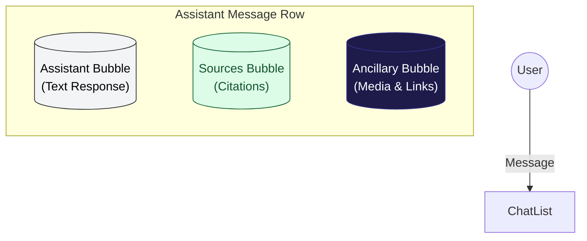

# Ancillary Responses Plan

## Overview

Ancillary Responses are context-aware supplemental information displayed alongside the standard Chat and Source bubbles. They provide rich media (images, videos) and external links relevant to the conversation content, triggered by specific keywords detected in the Assistant's response.

## User Interface

### The Ancillary Bubble
- **Placement**: Stacked to the **right** of the "Sources" bubble (or below/alongside depending on mobile/desktop layout, but logically paired with Sources).
- **Styling**: 
  - Background: **Dark Blue** (`#1e1b4b` or a specific theme variant).
  - Text: **White**.
  - Distinct from the Primary (User/Blue) and Secondary (Sources/Green) bubbles.

### Layout Diagram

### Content Display
- **Media**: Displayed as clickable thumbnails.
  - **Photos**: Show thumbnail with a caption/description underneath.
  - **YouTube**: Show video thumbnail/embed with a title.
- **Links**: Displayed as a list of clickable text links with names.

## Data Models

Projects will be extended to include two new resource types, both associated via a JSON array of `key_words`.

### 1. Project Media (`project_media`)
Represents visual content associated with topics.
- **id**: Primary Key
- **project_id**: Foreign Key (Projects)
- **type**: Enum (`photo`, `youtube`)
- **url**: Text (S3 URL for photos, Video ID/URL for YouTube)
- **description**: Text (Caption shown under the media)
- **keywords**: JSONB Array `["keyword1", "keyword2"]`

### 2. Project Links (`project_links`)
Represents external references or deep links.
- **id**: Primary Key
- **project_id**: Foreign Key (Projects)
- **url**: Text
- **name**: String (Display text)
- **keywords**: JSONB Array `["keyword1", "keyword2"]`

## Logic Flow

1. **Generation**: The Backend generates the Chat response (Built-in or RAG).
2. **Analysis**: The system scans the final generated text for matches against the Project's Media and Link keywords.
3. **Response Construction**:
   - If matches are found, an `ancillary` object is attached to the response (or streamed as a specialized event).
4. **Rendering**:
   - The Frontend detects the `ancillary` data.
   - It renders the **Ancillary Bubble** next to the Sources bubble.
   - Media and Links are populated within this bubble.

## Recommendations

### Database Schema
- Use `JSONB` for `keywords` in PostgreSQL to allow for efficient indexing if necessary, though simple JSON text matching in Python is likely sufficient for typical project sizes.
- Add `is_active` flags to both models to easily toggle resources without deletion.

### Keyword Matching Strategy
- **Case-Insensitive Matching**: Match "Naval" with "naval".
- **Lemmatization (Optional)**: Consider if "boat" should match "boats". For V1, exact substring or word boundary matching is recommended to avoid false positives.
- **Deduplication**: If multiple keywords trigger the same Media/Link, ensure it is only shown once.

### Admin Interface
- **Media Manager**: A new tab in `ProjectDetail` to upload images and add YouTube links.
  - Drag-and-drop upload for photos.
  - Preview for YouTube videos.
  - Tagging interface for Keywords (chip input).
- **Link Manager**: Simple CRUD table to add URLs and Keywords.

### Performance
- Cache project keywords in Redis (`project:{id}:keywords`) to avoid querying the DB for every chat message.
- Perform keyword matching asynchronously or as a post-processing step to not delay the initial chat stream.
