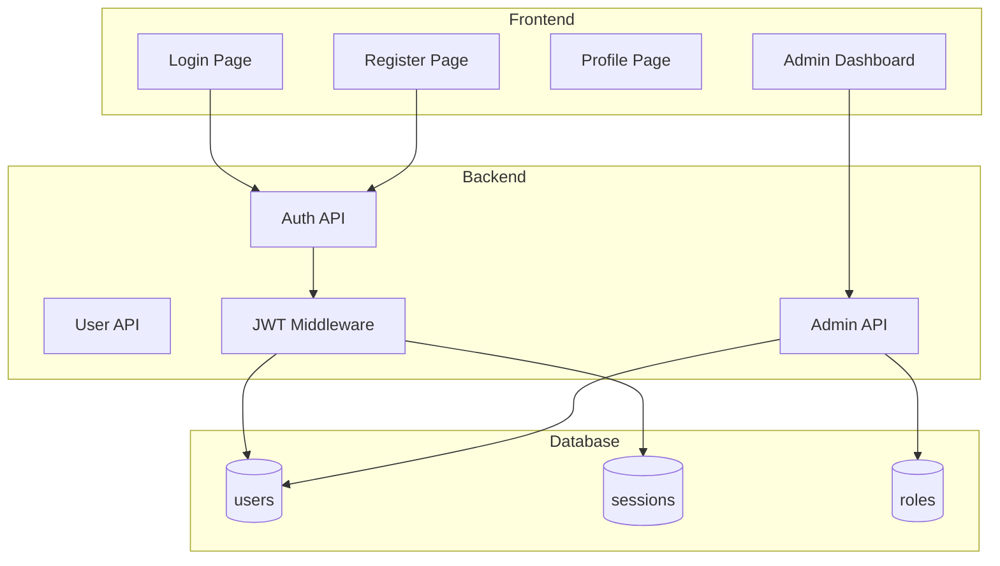

# Authentication & User Management Plan

A complete authentication system for DocuTok with user login, registration, role-based access, and admin UI.

## Overview



---

## Phase 1: Database Schema

### Users Table
```sql
CREATE TABLE users (
    id SERIAL PRIMARY KEY,
    email VARCHAR(255) UNIQUE NOT NULL,
    password_hash VARCHAR(255) NOT NULL,
    full_name VARCHAR(255),
    avatar_url VARCHAR(500),
    role VARCHAR(50) DEFAULT 'user',  -- 'user', 'admin', 'superadmin'
    is_active BOOLEAN DEFAULT true,
    is_verified BOOLEAN DEFAULT false,
    created_at TIMESTAMP WITH TIME ZONE DEFAULT NOW(),
    updated_at TIMESTAMP WITH TIME ZONE DEFAULT NOW(),
    last_login_at TIMESTAMP WITH TIME ZONE
);

CREATE INDEX idx_users_email ON users(email);
CREATE INDEX idx_users_role ON users(role);
```

### Sessions Table (for refresh tokens)
```sql
CREATE TABLE sessions (
    id SERIAL PRIMARY KEY,
    user_id INTEGER REFERENCES users(id) ON DELETE CASCADE,
    refresh_token VARCHAR(500) UNIQUE NOT NULL,
    device_info VARCHAR(255),
    ip_address VARCHAR(45),
    expires_at TIMESTAMP WITH TIME ZONE NOT NULL,
    created_at TIMESTAMP WITH TIME ZONE DEFAULT NOW()
);

CREATE INDEX idx_sessions_user_id ON sessions(user_id);
CREATE INDEX idx_sessions_token ON sessions(refresh_token);
```

### Password Reset Tokens
```sql
CREATE TABLE password_reset_tokens (
    id SERIAL PRIMARY KEY,
    user_id INTEGER REFERENCES users(id) ON DELETE CASCADE,
    token VARCHAR(255) UNIQUE NOT NULL,
    expires_at TIMESTAMP WITH TIME ZONE NOT NULL,
    used BOOLEAN DEFAULT false,
    created_at TIMESTAMP WITH TIME ZONE DEFAULT NOW()
);
```

---

## Phase 2: Backend Authentication Service

### File Structure
```
backend/app/
├── api/routes/
│   ├── auth.py          # Login, register, logout, refresh
│   ├── users.py         # Profile, update profile
│   └── admin.py         # User management for admins
├── core/
│   ├── security.py      # JWT, password hashing
│   └── deps.py          # Dependency injection (get_current_user)
├── models/
│   ├── user.py          # User SQLAlchemy model
│   └── session.py       # Session model
├── schemas/
│   ├── auth.py          # Login, register, token schemas
│   └── user.py          # User response schemas
└── services/
    ├── auth.py          # Auth business logic
    └── email.py         # Email verification, password reset
```

### Security Implementation

#### Password Hashing (bcrypt)
```python
# backend/app/core/security.py
from passlib.context import CryptContext
import jwt
from datetime import datetime, timedelta

pwd_context = CryptContext(schemes=["bcrypt"], deprecated="auto")

def hash_password(password: str) -> str:
    return pwd_context.hash(password)

def verify_password(plain: str, hashed: str) -> bool:
    return pwd_context.verify(plain, hashed)

def create_access_token(user_id: int, expires_delta: timedelta = None) -> str:
    expire = datetime.utcnow() + (expires_delta or timedelta(minutes=15))
    payload = {"sub": str(user_id), "exp": expire, "type": "access"}
    return jwt.encode(payload, settings.SECRET_KEY, algorithm="HS256")

def create_refresh_token(user_id: int) -> str:
    expire = datetime.utcnow() + timedelta(days=7)
    payload = {"sub": str(user_id), "exp": expire, "type": "refresh"}
    return jwt.encode(payload, settings.SECRET_KEY, algorithm="HS256")
```

#### JWT Middleware
```python
# backend/app/core/deps.py
from fastapi import Depends, HTTPException, status
from fastapi.security import HTTPBearer, HTTPAuthorizationCredentials

security = HTTPBearer()

async def get_current_user(
    credentials: HTTPAuthorizationCredentials = Depends(security),
    db: AsyncSession = Depends(get_db)
) -> User:
    token = credentials.credentials
    try:
        payload = jwt.decode(token, settings.SECRET_KEY, algorithms=["HS256"])
        if payload.get("type") != "access":
            raise HTTPException(status_code=401, detail="Invalid token type")
        user_id = int(payload.get("sub"))
    except jwt.ExpiredSignatureError:
        raise HTTPException(status_code=401, detail="Token expired")
    except jwt.InvalidTokenError:
        raise HTTPException(status_code=401, detail="Invalid token")
    
    user = await db.get(User, user_id)
    if not user or not user.is_active:
        raise HTTPException(status_code=401, detail="User not found or inactive")
    return user

async def get_admin_user(user: User = Depends(get_current_user)) -> User:
    if user.role not in ["admin", "superadmin"]:
        raise HTTPException(status_code=403, detail="Admin access required")
    return user
```

---

## Phase 3: Auth API Endpoints

### Authentication Routes
| Method | Endpoint | Description | Auth Required |
|--------|----------|-------------|---------------|
| POST | `/api/auth/register` | Create new account | No |
| POST | `/api/auth/login` | Login, get tokens | No |
| POST | `/api/auth/logout` | Invalidate refresh token | Yes |
| POST | `/api/auth/refresh` | Get new access token | Refresh Token |
| POST | `/api/auth/forgot-password` | Send reset email | No |
| POST | `/api/auth/reset-password` | Reset with token | No |
| POST | `/api/auth/verify-email` | Verify email address | No |

### User Routes
| Method | Endpoint | Description | Auth Required |
|--------|----------|-------------|---------------|
| GET | `/api/users/me` | Get current user profile | Yes |
| PATCH | `/api/users/me` | Update profile | Yes |
| PATCH | `/api/users/me/password` | Change password | Yes |
| DELETE | `/api/users/me` | Delete account | Yes |

### Admin Routes
| Method | Endpoint | Description | Auth Required |
|--------|----------|-------------|---------------|
| GET | `/api/admin/users` | List all users (paginated) | Admin |
| GET | `/api/admin/users/{id}` | Get user details | Admin |
| PATCH | `/api/admin/users/{id}` | Update user (role, status) | Admin |
| DELETE | `/api/admin/users/{id}` | Delete user | Admin |
| GET | `/api/admin/stats` | Dashboard statistics | Admin |

---

## Phase 4: Frontend Components

### New Pages
```
frontend/src/
├── pages/
│   ├── Login.tsx           # Login form
│   ├── Register.tsx        # Registration form
│   ├── ForgotPassword.tsx  # Request password reset
│   ├── ResetPassword.tsx   # Reset with token
│   ├── Profile.tsx         # User profile page
│   └── admin/
│       ├── Dashboard.tsx   # Admin overview
│       ├── Users.tsx       # User management table
│       └── UserDetail.tsx  # Edit individual user
├── components/
│   └── auth/
│       ├── ProtectedRoute.tsx  # Route guard
│       ├── AdminRoute.tsx      # Admin-only route
│       └── AuthProvider.tsx    # Auth context
└── context/
    └── AuthContext.tsx     # Auth state management
```

### Auth Context
```typescript
// frontend/src/context/AuthContext.tsx
interface AuthContextType {
    user: User | null;
    isAuthenticated: boolean;
    isLoading: boolean;
    login: (email: string, password: string) => Promise<void>;
    register: (data: RegisterData) => Promise<void>;
    logout: () => void;
    refreshToken: () => Promise<void>;
}
```

### Token Management
- Store access token in memory (React state)
- Store refresh token in HttpOnly cookie (more secure) or localStorage
- Auto-refresh access token before expiry
- Redirect to login on 401 responses

---

## Phase 5: Admin Dashboard

### Features
1. **Overview Cards**
   - Total users
   - New users (last 7 days)
   - Active sessions
   - Documents uploaded

2. **User Management Table**
   - Search by email/name
   - Filter by role/status
   - Sortable columns
   - Pagination
   - Actions: Edit, Deactivate, Delete

3. **User Detail View**
   - Profile information
   - Role assignment
   - Account status toggle
   - Login history
   - Documents owned

### Admin UI Mockup
```
┌─────────────────────────────────────────────────────────────┐
│ DocuTok Admin                          [User ▼] [Logout]    │
├─────────────────────────────────────────────────────────────┤
│                                                              │
│  ┌──────────┐ ┌──────────┐ ┌──────────┐ ┌──────────┐       │
│  │ Users    │ │ New (7d) │ │ Sessions │ │ Documents│       │
│  │   142    │ │    12    │ │    28    │ │    567   │       │
│  └──────────┘ └──────────┘ └──────────┘ └──────────┘       │
│                                                              │
│  Users                                    [+ Add User]      │
│  ┌─────────────────────────────────────────────────────────┐│
│  │ Email          Name         Role    Status    Actions   ││
│  │ ───────────────────────────────────────────────────────  │
│  │ john@...       John Doe     User    Active    [Edit]    ││
│  │ admin@...      Admin        Admin   Active    [Edit]    ││
│  │ jane@...       Jane Smith   User    Inactive  [Edit]    ││
│  └─────────────────────────────────────────────────────────┘│
│                                                              │
└─────────────────────────────────────────────────────────────┘
```

---

## Phase 6: Security Considerations

### Password Requirements
- Minimum 8 characters
- At least one uppercase, one lowercase, one number
- Check against common passwords list (optional)

### Rate Limiting
- Login: 5 attempts per 15 minutes per IP
- Register: 3 per hour per IP
- Password reset: 3 per hour per email

### Session Security
- Refresh tokens expire after 7 days
- Access tokens expire after 15 minutes
- Logout invalidates refresh token
- Option for "logout all devices"

### Protected Resources
- Documents linked to `user_id`
- Users can only see their own documents
- Admins can see all documents

---

## Phase 7: Environment Variables

```env
# Auth Configuration
SECRET_KEY=your-secret-key-min-32-chars
ACCESS_TOKEN_EXPIRE_MINUTES=15
REFRESH_TOKEN_EXPIRE_DAYS=7

# Email (for password reset, verification)
SMTP_HOST=smtp.gmail.com
SMTP_PORT=587
SMTP_USER=your-email@gmail.com
SMTP_PASSWORD=app-password
EMAIL_FROM=noreply@docutok.com
```

---

## Implementation Order

| Phase | Task | Priority |
|-------|------|----------|
| 1 | Database: Users, Sessions tables | High |
| 2 | Backend: Security utilities | High |
| 3 | Backend: Auth endpoints | High |
| 4 | Frontend: AuthContext | High |
| 5 | Frontend: Login/Register pages | High |
| 6 | Backend: Protected routes | High |
| 7 | Link Documents to Users | High |
| 8 | Frontend: Profile page | Medium |
| 9 | Backend: Admin endpoints | Medium |
| 10 | Frontend: Admin Dashboard | Medium |
| 11 | Password reset flow | Low |
| 12 | Email verification | Low |

---

## Dependencies to Add

### Backend
```toml
# pyproject.toml
passlib = { extras = ["bcrypt"], version = "^1.7.4" }
python-jose = { extras = ["cryptography"], version = "^3.3.0" }
# Optional for email
aiosmtplib = "^3.0.0"
```

### Frontend
```bash
npm install jwt-decode
```
