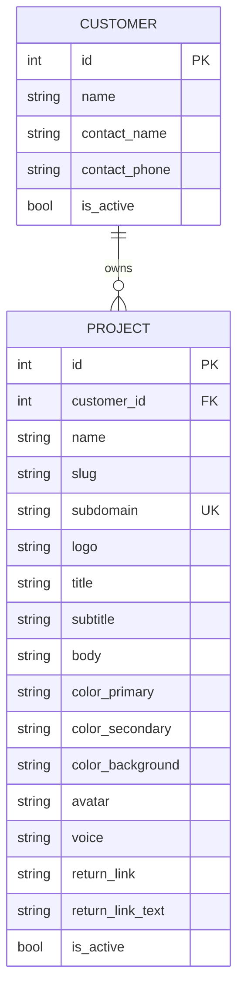

# Multi-Tenant Customer System

## Implementation Phases

| Phase | Name | Duration | Deliverables |
|-------|------|----------|--------------|
| 1 | Database Foundation | 3-4 days | Customer & Project models, migrations, seed data |
| 2 | Customer Management API | 3-4 days | CRUD endpoints for customers |
| 3 | Project Management API | 4-5 days | CRUD endpoints for projects, file uploads |
| 4 | Admin Frontend - Customers | 3-4 days | Customer list, create, edit pages |
| 5 | Admin Frontend - Projects | 4-5 days | Project list, create, edit pages with branding UI |
| 6 | Subdomain Routing | 3-4 days | Middleware, config detection, frontend context |
| 7 | Branded Chat Interface | 4-5 days | Dynamic theming, logo, avatar, voice integration |
| 8 | Content Isolation | 3-4 days | Document scoping, retrieval filtering |
| 9 | Testing & QA | 3-4 days | Unit, integration, E2E tests |
| 10 | Documentation & Deploy | 2-3 days | Docs, deployment scripts, monitoring |

**Total Estimated Duration**: 32-42 days (6-8 weeks)

---

## Overview

Transform DocuGab into a multi-tenant platform where customers can have isolated projects with customized branding, voice, and content. Each project has its own subdomain and contains documents specific to that use case. Customers are organizations that own multiple projects.

## Architecture

### Data Model

#### Customer Model
```python
class Customer:
    id: int                      # Primary key
    name: str                    # Customer organization name
    
    # Contact Information
    contact_name: str | None     # Primary contact person
    contact_phone: str | None    # Contact phone number
    
    # Metadata
    is_active: bool              # Enable/disable customer access
    created_at: datetime
    updated_at: datetime
```

#### Project Model
```python
class Project:
    id: int                      # Primary key
    customer_id: int             # FK to customers
    name: str                    # Project name (e.g., 'Employee Handbook')
    slug: str                    # URL-friendly identifier
    description: str | None      # Project description
    
    # Subdomain & Access
    subdomain: str               # Unique subdomain (e.g., 'acme-handbook' → acme-handbook.docugab.com)
    
    # Branding
    logo: str | None             # Path to project logo (/assets/logos/projects/{id}/logo.png)
    title: str                   # Chat interface title
    subtitle: str | None         # Chat interface subtitle
    body: str | None             # Additional text/instructions (shown in sidebar or homepage)
    color_primary: str           # Hex color for primary elements (#1976d2)
    color_secondary: str         # Hex color for secondary elements (#dc004e)
    color_background: str        # Hex color for background (#ffffff)
    
    # Avatar & Voice
    avatar: str                  # Path to GLB file (/assets/avatars/projects/{id}/avatar.glb)
    voice: str                   # Google TTS voice ID (e.g., 'en-US-Neural2-F')
    
    # Navigation
    return_link: str | None      # External link URL (e.g., https://acme.com)
    return_link_text: str | None # Link text (e.g., 'Back to Acme Corp')
    
    # Metadata
    is_active: bool              # Enable/disable project
    created_at: datetime
    updated_at: datetime
```

> **Note**: Documents remain unchanged and reference `project_id` foreign key (existing in current schema).

### Database Relationships



> **Documents**: Existing `documents` table already has `project_id` column. No schema changes needed for documents.

## Routing & Isolation

### Subdomain Detection
- **Pattern**: `{project-subdomain}.docugab.com` or `{project-subdomain}.localhost:5177` (dev)
- **Backend**: Middleware extracts subdomain from `Host` header, loads project config
- **Frontend**: React context provides project configuration (branding, voice, avatar)

### URL Structure
```
# Project subdomains (each project has its own subdomain)
https://acme-handbook.docugab.com/           → Project-branded chat interface
https://acme-support.docugab.com/            → Different project, same customer

# Admin routes (main domain only)
https://docugab.com/admin/customers          → Customer list
https://docugab.com/admin/customers/{id}     → Customer detail/edit
https://docugab.com/admin/projects           → All projects
https://docugab.com/admin/projects/{id}      → Project detail/edit
```

### Content Isolation
- Documents scoped to projects via `project_id` foreign key
- Chat retrieval filtered by `project_id`
- No cross-project data leakage

## Frontend Pages

### Admin Pages (Main Domain)

#### `/admin/customers`
- **Purpose**: List and manage all customers
- **Features**:
  - Table with subdomain, name, projects count, active status
  - Search/filter by name or subdomain
  - Create new customer button
  - Click row to edit

#### `/admin/customers/new`
- **Purpose**: Create new customer
- **Form fields**:
  - Name, subdomain
  - Logo upload
  - Title, subtitle
  - Color pickers (primary, secondary, background)
  - Avatar selection (dropdown from `/assets/avatars/customers/{subdomain}/`)
  - Voice selection (dropdown)
  - Return link URL and text

#### `/admin/customers/{id}`
- **Purpose**: Edit customer details
- **Features**:
  - Same form as create
  - Delete customer button (with cascade warning)
  - Projects list (inline table)
  - "Add Project" button

#### `/admin/projects`
- **Purpose**: List all projects across all customers
- **Features**:
  - Table with customer name, project name, documents count, status
  - Filter by customer
  - Search by project name

#### `/admin/projects/{id}`
- **Purpose**: Edit project details
- **Form fields**:
  - Name, slug, description
  - Customer selection (dropdown)
  - Custom text (textarea)
  - Active toggle
  - Documents list (inline table with upload)

### Project Pages (Subdomains)

#### `/{subdomain}`
- **Purpose**: Customer-branded chat interface
- **Customization**:
  - Apply customer colors to MUI theme
  - Display customer logo
  - Show title/subtitle
  - Use customer avatar and voice
  - Show return link if configured

## API Endpoints

### Customer Management
| Method | Endpoint | Description |
|--------|----------|-------------|
| GET | `/api/admin/customers` | List all customers |
| GET | `/api/admin/customers/{id}` | Get customer details |
| POST | `/api/admin/customers` | Create customer |
| PATCH | `/api/admin/customers/{id}` | Update customer |
| DELETE | `/api/admin/customers/{id}` | Delete customer |

### Project Management
| Method | Endpoint | Description |
|--------|----------|-------------|
| GET | `/api/admin/projects` | List all projects |
| GET | `/api/admin/projects/{id}` | Get project details |
| POST | `/api/admin/projects` | Create project |
| PATCH | `/api/admin/projects/{id}` | Update project |
| DELETE | `/api/admin/projects/{id}` | Delete project |

## Configuration

### Environment Variables
```env
# Multi-tenant
ALLOWED_DOMAINS=localhost,docugab.com
CUSTOMER_ASSETS_PATH=/app/frontend/public/assets/customers
```

### Asset Organization
```
frontend/public/assets/
  avatars/
    customers/
      acme/
        executive.glb
        support.glb
      techcorp/
        assistant.glb
  logos/
    customers/
      acme/
        logo.png
      techcorp/
        logo.svg
```

## Recommendations

### Phase 1: Foundation (Week 1-2)
1. **Database schema**: Create `customers` and `projects` tables
2. **Alembic migration**: Add `project_id` to documents, maintain backward compatibility
3. **Admin models**: SQLAlchemy models with proper relationships
4. **Seed data**: Create test customer via migration

### Phase 2: Admin Interface (Week 2-3)
1. **Backend routes**: CRUD endpoints for customers and projects
2. **Frontend pages**: Build admin customer/project management UI
3. **File uploads**: Logo and avatar upload handling
4. **Color pickers**: Integrate color selection component

### Phase 3: Subdomain Routing (Week 3-4)
1. **Backend middleware**: Extract subdomain, load customer config
2. **Frontend context**: Customer configuration provider
3. **Dynamic theming**: Apply customer colors to MUI theme
4. **Avatar/voice**: Pass customer settings to TalkingHead component

### Phase 4: Content Isolation (Week 4-5)
1. **Document scoping**: Update upload to assign `project_id`
2. **Retrieval filtering**: Modify chat to filter by project
3. **Project routes**: Implement project-specific chat pages
4. **Breadcrumbs**: Add navigation hierarchy

### Phase 5: Polish (Week 5-6)
1. **Return link**: Implement external link in header/sidebar
2. **Logo display**: Add customer logo to branded interface
3. **Custom text**: Inject project context into chat system prompt
4. **Access control**: Ensure customers can't access admin routes

### Security Considerations
- **Subdomain validation**: Whitelist allowed subdomains, prevent subdomain hijacking
- **Asset isolation**: Customers can't access other customers' assets
- **Database queries**: Always filter by `customer_id` or `project_id`
- **Admin-only routes**: Require `admin` role for customer/project management
- **CORS**: Configure for subdomain access

### Performance Optimizations
- **Customer config caching**: Redis cache for subdomain → customer lookups
- **Asset CDN**: Consider CDN for customer logos/avatars
- **Connection pooling**: Ensure database can handle multi-tenant load

### Testing Strategy
1. **Unit tests**: Customer/project CRUD operations
2. **Integration tests**: Subdomain routing, content isolation
3. **E2E tests**: Create customer → create project → upload document → chat
4. **Load tests**: Multiple customers accessing simultaneously

### Migration Path
1. **Backward compatibility**: Existing documents (`user_id` only) remain accessible
2. **Dual mode**: Support both authenticated users and customer subdomains
3. **Gradual rollout**: Enable per-customer with feature flag
4. **Data migration**: Optional script to migrate user documents to projects

### Future Enhancements
- **Customer analytics**: Usage metrics per customer/project
- **Custom domains**: Allow `docs.acme.com` instead of `acme.docugab.com`
- **Customer API keys**: Programmatic access for integrations
- **Project templates**: Pre-configured project types (handbook, FAQ, support)
- **Multi-language**: Per-customer language settings
- **Webhooks**: Notify customer systems of chat events
