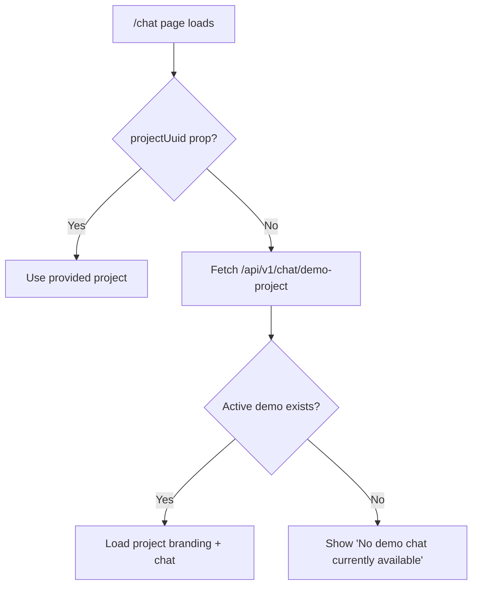

# Demo Projects Feature Implementation Plan

## Overview

Enable multiple demo projects with an "Active Demo Project" selection. The active demo project will be displayed on the public `/chat` page.

## Current State

- **Project Model**: Has `is_demo` boolean field (line 72-74 in `project.py`)
- **Chat Page**: Accepts `projectUuid` prop to specify which project to show
- **No active demo selection**: Currently no mechanism to mark one demo as "active"

---

## Proposed Changes

### Backend

#### [MODIFY] [project.py](file:///Users/andrewault/dev/ault/DocuGab/backend/app/models/project.py)

Add new field to Project model:
```python
is_active_demo: Mapped[bool] = mapped_column(
    Boolean, default=False, server_default=sql.false(), nullable=False
)
```

---

#### [NEW] [0008_add_is_active_demo.py](file:///Users/andrewault/dev/ault/DocuGab/backend/alembic/versions/0008_add_is_active_demo.py)

Migration to add `is_active_demo` column to projects table.

---

#### [NEW] [demo_projects.py](file:///Users/andrewault/dev/ault/DocuGab/backend/app/api/routes/admin_routes/demo_projects.py)

Admin routes:
- `GET /api/v1/admin/demo-projects/` - List all projects where `is_demo=True`
- `POST /api/v1/admin/demo-projects/{uuid}/activate` - Set a project as active demo (deactivate others)

---

#### [MODIFY] [chat.py](file:///Users/andrewault/dev/ault/DocuGab/backend/app/api/routes/chat.py)

Add public endpoint:
- `GET /api/v1/chat/demo-project` - Returns the active demo project's UUID and details (no auth required)

If no active demo exists, return:
```json
{"active": false, "message": "No demo chat currently available"}
```

---

#### [MODIFY] [__init__.py](file:///Users/andrewault/dev/ault/DocuGab/backend/app/api/v1/__init__.py)

Register new `demo_projects` router under admin routes.

---

### Frontend

#### [NEW] [DemoProjects.tsx](file:///Users/andrewault/dev/ault/DocuGab/frontend/src/pages/admin/DemoProjects.tsx)

Admin page listing demo projects with:
- Standard gradient header styling
- Table with columns: Name, Customer, Status, Actions
- "Select" button to activate a demo project
- Active project highlighted with chip

---

#### [MODIFY] [AdminSidebar.tsx](file:///Users/andrewault/dev/ault/DocuGab/frontend/src/components/AdminSidebar.tsx)

Add nav item:
```tsx
{ label: 'Demo Projects', icon: <PlayCircle />, path: '/admin/demo-projects' }
```

---

#### [MODIFY] [App.tsx](file:///Users/andrewault/dev/ault/DocuGab/frontend/src/App.tsx)

Add route:
```tsx
<Route path="/admin/demo-projects" element={<DemoProjects />} />
```

---

#### [MODIFY] [Chat.tsx](file:///Users/andrewault/dev/ault/DocuGab/frontend/src/pages/Chat.tsx)

When rendered at `/chat` without a `projectUuid` prop:
1. Fetch active demo project from `/api/v1/chat/demo-project`
2. If active demo exists, pass its UUID to the chat component
3. If no active demo, display: "No demo chat currently available"

---

## Data Flow



---

## Recommendations

### 1. Caching
Consider adding in-memory caching for the active demo project (similar to `chat_parameters` caching) to avoid database queries on every `/chat` page load.

### 2. Validation
The `/activate` endpoint should validate that the project has `is_demo=True` before allowing activation.

### 3. UI Feedback
When activating a demo project, show a success toast. Consider adding a "Preview" button to quickly view the active demo.

### 4. Future Enhancement: Demo Project Branding Preview
Add a preview thumbnail in the Demo Projects list showing the project's colors/branding.

### 5. Consider "None" Option
Allow deactivating all demos (set `is_active_demo=False` for all) so the `/chat` page can intentionally show "No demo available."

### 6. Audit Trail
Consider logging when the active demo is changed for admin auditing purposes.

---

## Verification Plan

### Automated Tests
Run existing backend tests:
```bash
cd backend && pytest tests/ -v
```

### Manual Verification
1. Navigate to `/admin/demo-projects` - should list projects where `is_demo=True`
2. Click "Select" on a project - should activate it (show Active chip)
3. Navigate to `/chat` - should display the active demo project's chat
4. Deactivate all demos - `/chat` should show "No demo chat currently available"
